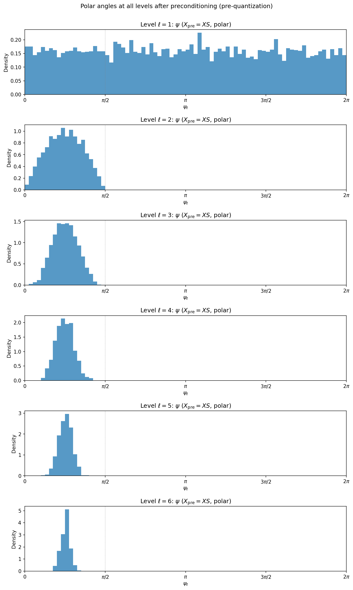
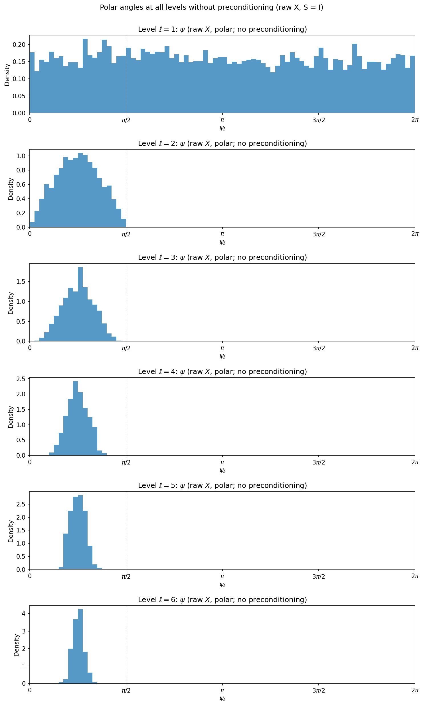
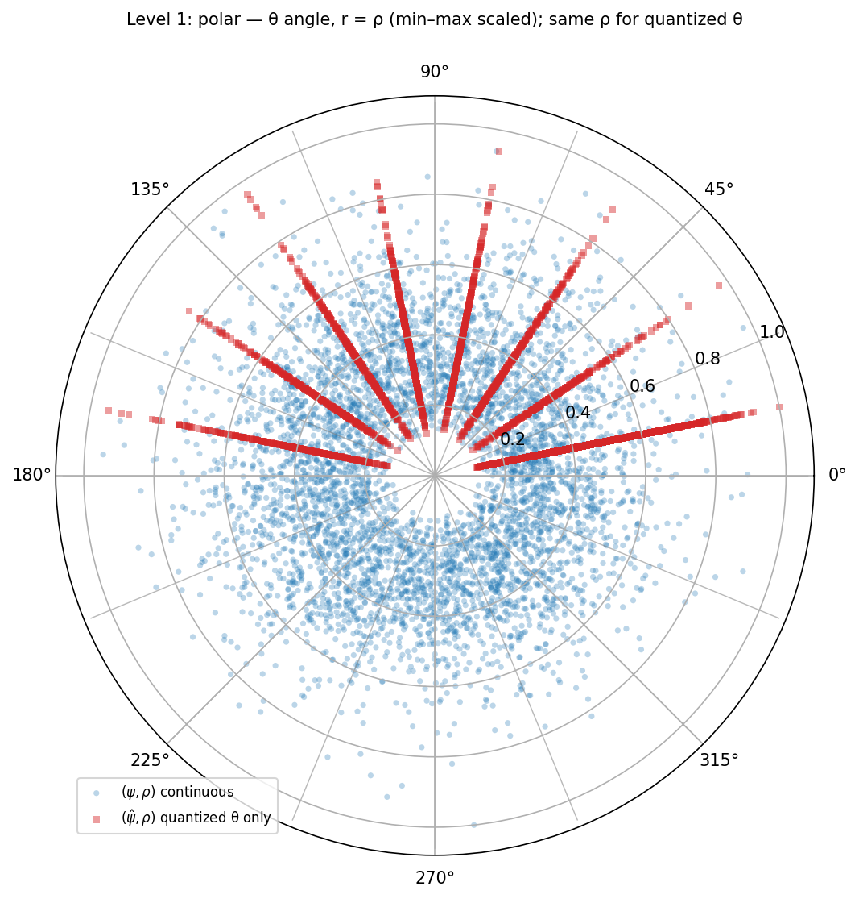
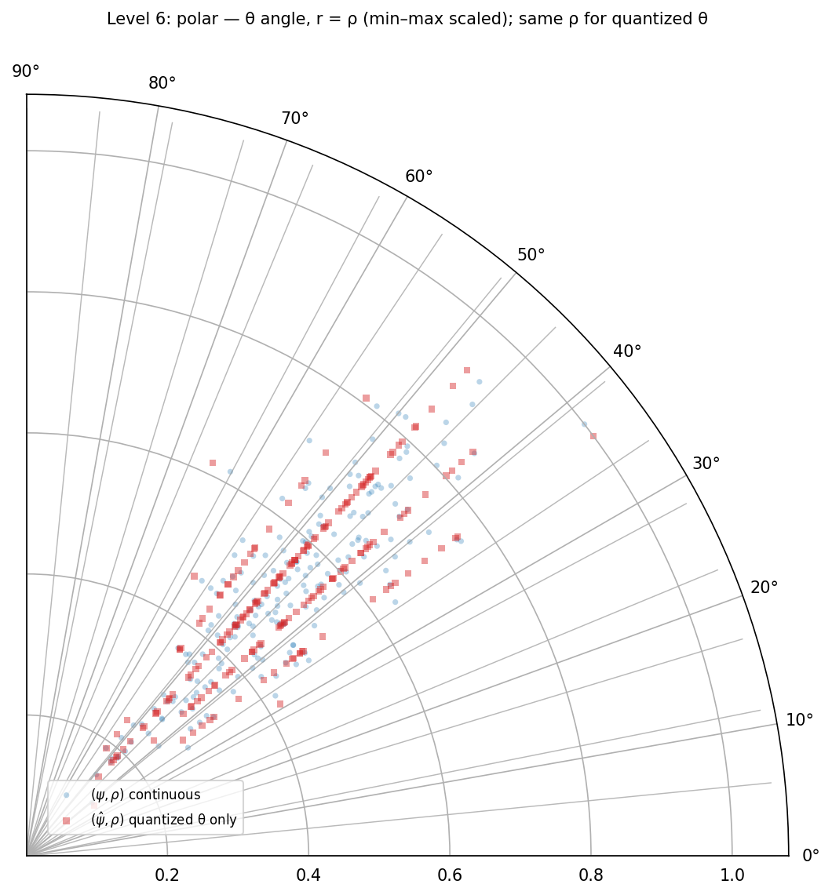

# polar-quant

## Paper this code is based on

**PolarQuant: Quantizing KV Caches with Polar Transformation**  
Insu Han, Praneeth Kacham, Amin Karbasi, Vahab Mirrokni, Amir Zandieh — submitted 4 Feb 2025.

| Resource | Link |
|----------|------|
| **Abstract & metadata** | <https://arxiv.org/abs/2502.02617> |
| **PDF** | <https://arxiv.org/pdf/2502.02617> |
| **arXiv ID** | `arXiv:2502.02617` |

If you use these ideas or this repo in research, **cite the PolarQuant paper** (BibTeX at the end of this README). This repository is an independent Python sketch for learning and experiments, not the authors’ official release.

---

The paper’s method applies a **random orthogonal preconditioner** \(S\), a **recursive polar transform** on rows of \(X S\), and **Lloyd–Max-style** scalar quantization of the resulting angles \(\psi_\ell\) using analytically motivated codebooks—the same structure implemented in `polarquant_core.py`.

This repository is a **compact Python reference**: `polarquant_core.py` implements the transform, PDFs, codebooks, and quantization; `utils/plotting.py` generates diagnostics; `dataset/` holds a sample exported **V-cache** JSON matrix for experiments.

---

## What you will see in the figures

### Angle histograms (all levels)

After preconditioning, each level’s \(\psi_\ell\) is histogrammed on \([0, 2\pi)\) (level 1 uses a \([0,2\pi)\) wrap so `atan2`’s \((-\pi,\pi]\) mass appears on the full circle). For **isotropic Gaussian** synthetic data, **with vs without** \(S\) can look similar in the aggregate because rotation preserves that distribution; real cache activations need not behave the same way.

| After preconditioning \(X_{\mathrm{pre}} = X S\) | Raw \(X\) (no preconditioning, \(S = I\)) |
| :---: | :---: |
|  |  |

### Polar view: continuous \(\psi\) vs quantized \(\hat\psi\)

Polar plots pair **angle** with **radius** from the same level’s \(\rho\) (min–max scaled for visibility). **Level 1** spans a full turn; **deeper levels** use a narrower angular sector \([0, \pi/2]\), so the wedge tightens as \(\ell\) grows. Each figure draws **two** layers (continuous and quantized), so the disk can look dense especially at level 1.

<p align="middle">
  
  &nbsp;
  
</p>

<p align="center"><em>Left: \(\ell = 1\) (full circle). Right: \(\ell = 6\) (narrow sector).</em></p>

*(Figures above are produced by the current pipeline on the bundled dataset; regenerate with `python polarquant_main.py`.)*

---

## Layout

| Path | Role |
|------|------|
| `polarquant_core.py` | Polar transform, `angle_pdf` / Lloyd–Max on a grid, `polarquant`, `init_polarquant_inputs`, `init_polarquant_inputs_from_file` |
| `polarquant_main.py` | End-to-end demo: load or synthesize \(X\), run `polarquant`, write figures under `plots/` |
| `utils/plotting.py` | Histograms, polar/scatter helpers, `plots_output_path` → all saved PNGs go to **`plots/`** |
| `utils/cache_loader.py` | Load a rectangular JSON matrix (CLI: `python utils/cache_loader.py`) |
| `dataset/` | Example `*_cache_v.json` (rows × head dimension); shapes drive `n` and `d` when loading from file |

---

## Setup

- **Python 3.10+** recommended  
- **Dependencies:** `numpy`, `matplotlib`  
  ```bash
  pip install numpy matplotlib
  ```

Use a Conda env (e.g. `r2026.1`) if you already rely on one; in Cursor/VS Code, **Python: Select Interpreter** should point at that environment.

---

## Run

From the repo root:

```bash
python polarquant_main.py
```

In `polarquant_main.py`, set:

- **`load_inputs_from_dataset = True`** — `n` and `d` come from the first `*.json` under `dataset/` (must be a rectangular float matrix; **`d` must be a power of two** for the polar tree).
- **`load_inputs_from_dataset = False`** — synthetic \(X \sim \mathcal{N}(0,I)\) with **`nb_samples`** and **`dim`**.

Figures are written to **`plots/`** (directory is created automatically).

**Inspect dataset dimensions only:**

```bash
python utils/cache_loader.py
# or: python utils/cache_loader.py dataset/your_file.json
```

**Debug:** `.vscode/launch.json` includes **PolarQuant: polarquant_main**.

---

## Citation (PolarQuant paper)

```bibtex
@article{han2025polarquant,
  title={PolarQuant: Quantizing KV Caches with Polar Transformation},
  author={Han, Insu and Kacham, Praneeth and Karbasi, Amin and Mirrokni, Vahab and Zandieh, Amir},
  journal={arXiv preprint arXiv:2502.02617},
  year={2025}
}
```

Paper PDF: <https://arxiv.org/pdf/2502.02617>
